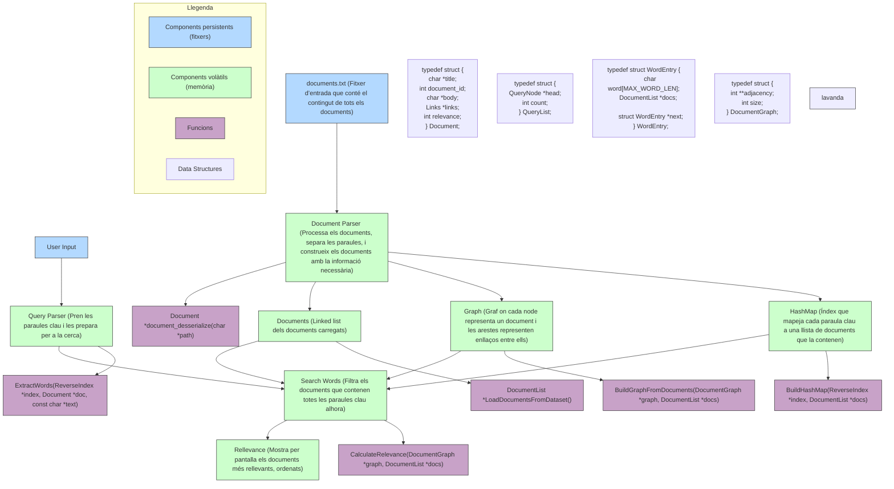

# Report: Building a search engine like Google
## Diagrama de components (C4) 

## Anàlisi de complexitat

| Descripció                                                           | Big-O       | Justificació                                                                 |
|----------------------------------------------------------------------|-------------|------------------------------------------------------------------------------|
| Parsing d’un document al `struct` (amb enllaços)                    | O(n)        | n = paraules del document // Es llegeixen totes les paraules del document una a una                        |
| Parsing d’una consulta al `struct`                                  | O(k)        | k = paraules clau de la consulta // La consulta es divideix en k paraules clau, cada una es processa un cop                                            |
| Recompte de veïns al graf global (`adjacencyList`)                  | O(V + E)    | V = documents, E = enllaços // S’exploren tots els nodes (documents) i les seves connexions                       |
| Recompte de nodes veïns d’un document                                     | O(d)        | d = grau del document // S’accedeix a la llista d’adjacència del document     |
| Cerca de documents amb una paraula clau (`HashMap`)                 | O(1)        | El `HashMap` permet accés constant per clau                                                    |
| Cerca de documents que continguin totes les paraules clau           | O(l · d)    | d = mida mitjana de la llista de documents per paraula // Es recuperen l llistes i es comparen els documents que hi apareixen            |
| Ordenació dels documents per score de rellevància                   | O(n log n)  | n = documents candidats a ordenar // Es fa sort d’una llista de n documents candidats segons el score     |

## Graficar el temps de cerca
### Amb i sense reverse index (per diferents datasets-size)

Amb reverse index, el temps de cerca es manté gairebé constant gràcies a l’accés directe via HashMap. En canvi, sense índex invers, el sistema ha de recórrer tots els documents, cosa que fa créixer el temps de manera lineal.

### Temps d'inicialització per diferents slots

El temps d’inicialització creix lleugerament amb el nombre de slots, ja que s’han de preparar més posicions a la taula de hash. Tot i així, aquest cost és petit i raonable comparat amb la millora que aporta després a la cerca.

### Temps de cerca per diferents slots

Quan el slot_count és petit, les col·lisions són freqüents i la cerca és més lenta. A mesura que augmenta, el rendiment millora fins que s’estabilitza, mostrant que a partir d’un cert punt, afegir més slots ja no aporta guanys significatius en eficiència.

## Millora amb el reverse index
Una millora de l’índex invers seria ordenar les llistes de documents i utilitzar cerca binària per accelerar la cerca de paraules. Aquesta millora augmentaria lleugerament l’ús de memòria i faria que la inicialització fos una mica més lenta (O(n log d)), però milloraria considerablement la velocitat de cerca (O(log d) en lloc de O(d)). Per tant, el temps d’execució global seria inferior en escenaris amb moltes cerques.

